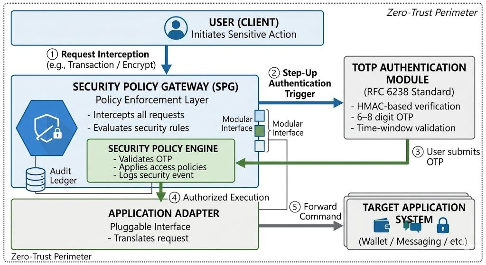

Secure Policy Gateway (SPG)
## Architecture

SPG is a conceptual security middleware designed to enforce operation-level access control using a Zero-Trust model.

Instead of trusting a session after login, SPG validates each sensitive operation independently.

Core concepts:
- Decoupled security layer
- Operation-level authentication
- Policy-based enforcement engine
- Adapter-based integration model
- Audit logging for security events

This project is currently a research / conceptual architecture.
